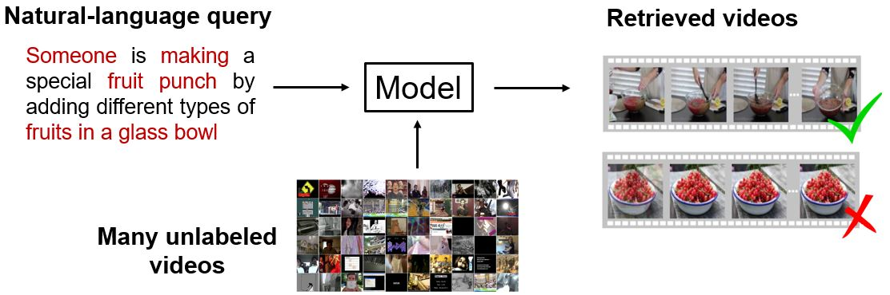

# video-retrieval
Deep Learning for Video Retrieval by Natural Language




## [Dataset](https://github.com/li-xirong/avs)

### Frame-level features
| CNN feature | Dimensionality | Downloads |
|:----- | -----:|:----- |
| ResNext-101 | 2,048 | [IACC.3 (27GB)](http://39.104.114.128/avs/iacc.3_ResNext-101.tar.gz), [MSR-VTT (2GB)](http://39.104.114.128/avs/msrvtt10k_ResNext-101.tar.gz), [TGIF (7GB)](http://39.104.114.128/avs/tgif_ResNext-101.tar.gz), [MSVD (288M)](http://39.104.114.128/avs/msvd_ResNext-101.tar.gz), [TV2016VTT-train (42M)](http://39.104.114.128/avs/tv2016train_ResNext-101.tar.gz) |
| ResNet-152 | 2,048 | [IACC.3 (26GB)](http://39.104.114.128/avs/iacc.3_ResNet-152.tar.gz), [MSR-VTT (2GB)](http://39.104.114.128/avs/msrvtt10k_ResNet-152.tar.gz), [TGIF (7GB)](http://39.104.114.128/avs/tgif_ResNet-152.tar.gz), [MSVD (283M)](http://39.104.114.128/avs/msvd_ResNet-152.tar.gz), [TV2016VTT-train (42M)](http://39.104.114.128/avs/tv2016train_ResNet-152.tar.gz) |

### Video-level features
* [Google drive](https://drive.google.com/drive/folders/1XiCudpjZVAUUg41TSB-u_HZE6qVnJpxC)

### Sentences 
* [MSR-VTT (3MB)](http://39.104.114.128/avs/msrvtt10k_textdata.tar.gz)
* [TGIF (2MB)](http://39.104.114.128/avs/tgif_textdata.tar.gz) 
* [MSVD (945K)](http://39.104.114.128/avs/msvd_textdata.tar.gz)
* [TV2016VTT-train (11K)](http://39.104.114.128/avs/tv2016train_textdata.tar.gz)


## Methods
* [W2VV](https://github.com/danieljf24/w2vv)
* [W2VV++](https://github.com/li-xirong/w2vvpp)
* [Dual encoding](https://github.com/danieljf24/dual_encoding)


## Leaderboard

Leaderboard of TRECVID 2016, 2017, 2018 ad-hoc video search task.

|  | 2016 | 2017 | 2018 |
|:----- | :-----: | :-----: | :-----: |
| **Top-3 TRECVID finalists** | | |
| Rank 1 | 0.054 | 0.206 | 0.121 |
| Rank 2 | 0.051 | 0.159 | 0.087 |
| Rank 3 | 0.040 | 0.120 | 0.082 |
| **Literature methods** | | |
| [Markatopoulou et al.](https://dl.acm.org/citation.cfm?id=3079041) | 0.064| - | - |
| [Habibian et al.](https://habibian.github.io/publications/habibian16pami.pdf) | 0.087| 0.150 | - |
| [W2VV](https://arxiv.org/pdf/1709.01362.pdf)* | 0.050 | 0.081 | 0.013 |
| [W2VV++](http://lixirong.net/pub/mm2019-w2vvpp.pdf)* | 0.137 | 0.168 | 0.088 |
| [Dual encoding](http://openaccess.thecvf.com/content_CVPR_2019/papers/Dong_Dual_Encoding_for_Zero-Example_Video_Retrieval_CVPR_2019_paper.pdf)* | 0.159 | 0.208 | ? |
\* indicates the model using provided ResNext-101 feature. 


## References
```
@article{dong2018predicting,
  title={Predicting visual features from text for image and video caption retrieval},
  author={Jianfeng Dong and Xirong Li and Cees G. M. Snoek},
  journal={IEEE Transactions on Multimedia},
  volume={20},
  number={12},
  pages={3377-3388},
  year={2018},
  doi = {10.1109/TMM.2018.2832602},
}
```

```
@inproceedings{mm19-w2vvpp,
title = {{W2VV}++: Fully Deep Learning for Ad-hoc Video Search},
author = {Xirong Li and Chaoxi Xu and Gang Yang and Zhineng Chen and Jianfeng Dong},
year = {2019},
booktitle = {ACMMM},
}
```

```
@inproceedings{cvpr2019-dual-dong,
title = {Dual Encoding for Zero-Example Video Retrieval},
author = {Jianfeng Dong and Xirong Li and Chaoxi Xu and Shouling Ji and Yuan He and Gang Yang and Xun Wang},
booktitle = {IEEE Conference on Computer Vision and Pattern Recognition (CVPR)},
year = {2019},
}
```